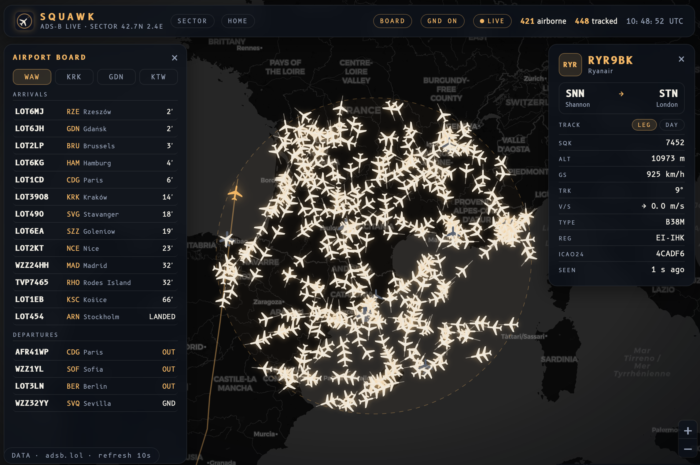

# Squawk

Live ADS-B mini-radar showing air traffic over Poland. A FastAPI backend fetches and caches aircraft positions from adsb.lol, a React + Leaflet frontend draws them on a dark map. "Squawk" is the four-digit transponder code that air traffic control assigns to every flight.



## Features

- live aircraft positions over Poland, refreshed every 10 s
- icons rotated to the aircraft's track, with a velocity vector (longer = faster)
- click a plane: airline, route (from -> to), aircraft type, squawk code, altitude, speed, vertical rate
- full flight path drawn from takeoff, extended live while the plane flies
- ground targets filter, hover tooltip, smooth movement between updates
- link status: LIVE / STALE (last known data when OpenSky throttles) / NO LINK
- UTC clock and a radar ping on each data refresh

## Run locally

Requirements: Python 3.12+, Node 20+.

Backend:

```bash
cd backend
python3 -m venv .venv
./.venv/bin/pip install -r requirements.txt
./.venv/bin/uvicorn main:app --reload --port 8000
```

Frontend (second terminal):

```bash
cd frontend
npm install
npm run dev
```

Positions need no API key. Optionally, put OpenSky API credentials in `backend/.env` (see `.env.example`) - they enable the full flight path from takeoff, without them the app draws the path collected while it runs. If the data source is unreachable, the app keeps showing last known positions with a STALE badge.

## Data & credits

- live positions: [adsb.lol](https://adsb.lol/) (open community API)
- flight tracks: [OpenSky Network](https://opensky-network.org/) (non-commercial use)
- routes and aircraft info: [adsbdb](https://www.adsbdb.com/)
- map tiles: © [OpenStreetMap](https://www.openstreetmap.org/copyright) contributors, © [CARTO](https://carto.com/attributions)
- font: [B612](https://b612-font.com/) (SIL Open Font License), designed for Airbus cockpit displays
